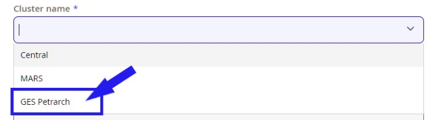

# Getting an Account

Use the University of Glasgow’s self-service portal Ivanti to request your account.

[User Registration](https://glasgow.saasiteu.com/Modules/SelfService/#serviceCatalog/request/6C80D9CCDE5A4B4D8134B617A9A33865){ .md-button }

=== "Lochan"

    Any staff, student and affiliate user within the University of Glasgow is eligible to use Lochan. As affiliate / honorary you’ll need a University of Glasgow email address, which you can request through the Ivanti help desk portal. 

    The account will be bound to your University of Glasgow GUID, and therefore will have the same credentials and be disabled when you leave the organisation. 

    We expect users to request their own account. A user account request should not be submitted by another person on behalf of that user. If you have a request for a bulk account creation of more than 10 accounts, please open a HPC Support request through Ivanti.

    In the case, where a formerly student user becomes a staff member with a new GUID they must request a new account through Ivanti. If the data of the old student account is still available, an admin may move the data over, upon request by the user.

=== "GES-Petrarch"

    GES-Petrarch has an Ivanti presence for the system. We are using the same HPC tiles that are used for other clusters within the university. You will see Petrarch in the dropdown:

    

=== "MARS"

    We are happy to see you want to join MARS! Eligible for access are Staff and Students within MVLS or [affiliates / honorary](https://www.gla.ac.uk/myglasgow/it/businesssystems/hms/) and collaborators from other colleges, if they are part of a MARS approved and MVLS funded project. As affiliate / honorary you’ll also need a University of Glasgow email address, which you can request through the Ivanti help desk portal.
    
    The account will be bound to your University of Glasgow GUID, and therefore will have the same credentials and be disabled when your main account does.
    
    If you want to start a larger scale project or collaborate with colleagues, please see [Getting a project]() on MARS for more information!
    
    We expect users to request their own account. A user account request should not be submitted by another person on behalf of that user. If you have a request for a bulk account creation of more than 10 accounts, please [contact us]()!
    
    Use the University of Glasgow’s self-service portal Ivanti to request your account. Choose MARS in the “Cluster name” dropdown.
