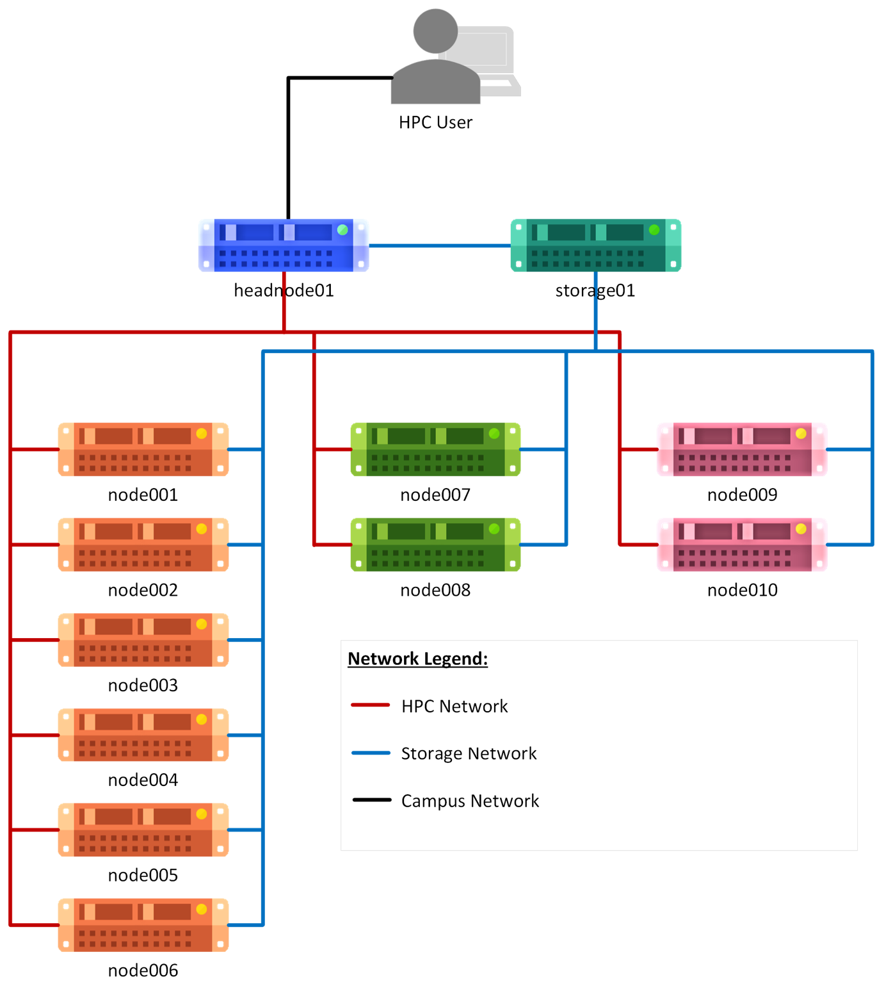

# GES Petrarch HPC Cluster
This cluster was built by RCaaS HPC Engineers with hardware provided by the School of Geography and Earth Sciences within the College of Science and Engineering at the University of Glasgow in 2023-2024.

## System Overview

### System Layout

### Technology

All servers of the cluster run on Rocky Linux 9. Rocky Linux (RL) is a Red Hat based open-source operating system.

The cluster's scheduler is the Slurm Workload Manager, developed by SchedMD. This software is crucial for HPC and helps achieve fair usage of all available compute resources.

The cluster and storage mounted on to the system are located in Saughfield House on the University of Glasgow Campus next to the Library.

## Acknowlegement
Where GES Petrarch is used in the development of research outputs the following attribution should be used:
> This research utilised the University of Glasgow’s GES Petrarch HPC, supported by University of Glasgow Research Computing as a Service. (https://hpc.gla.ac.uk/clusters/gesp/)
