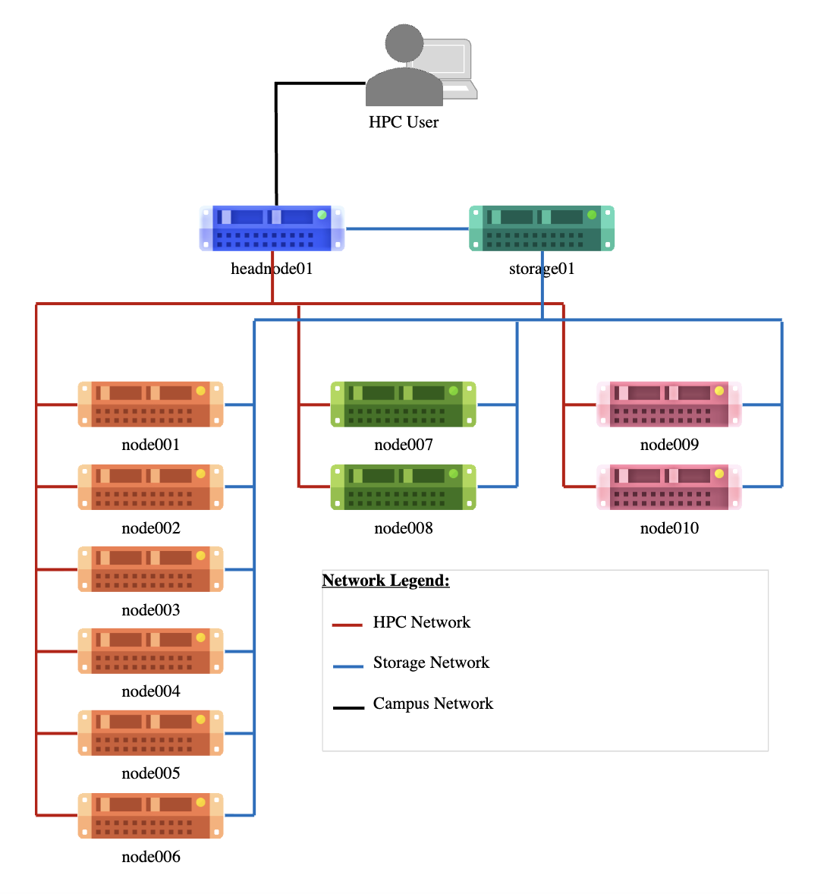
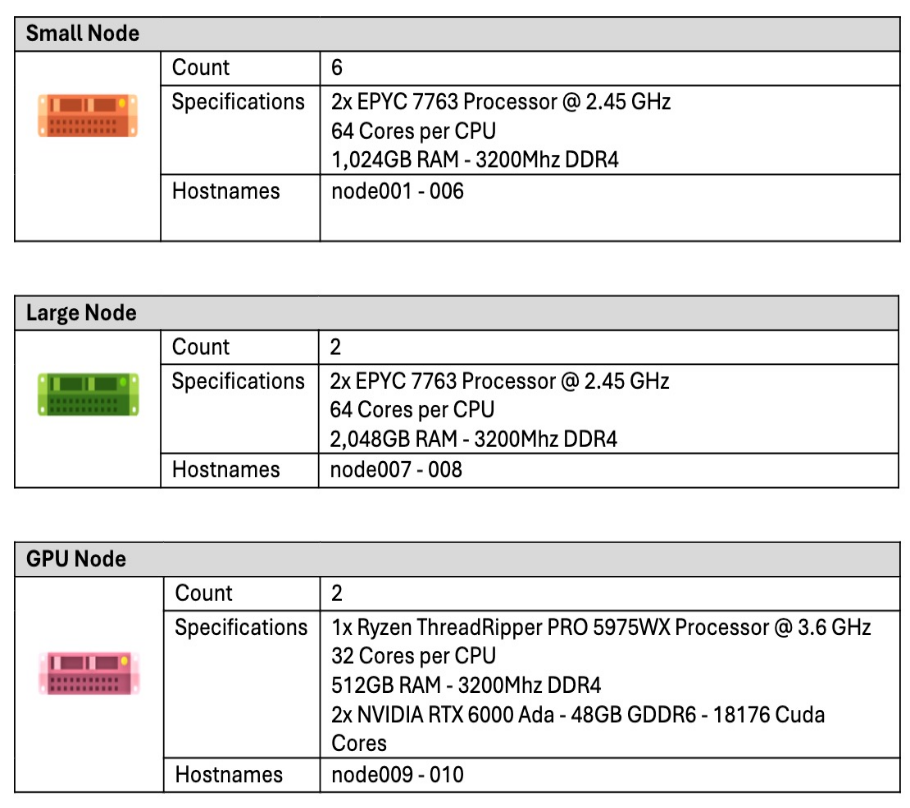

# GES Petrarch HPC Cluster
This cluster was built by RCaaS HPC Engineers with hardware provided by the School of Geography and Earth Sciences within the College of Science and Engineering at the University of Glasgow in 2023-2024.

## System Overview

### System Layout


### Technology



All servers of the cluster run on Oracle Linux 9. Oracle Linux (OL) is a Red Hat based open-source operating system.

The cluster's scheduler is the Slurm Workload Manager, developed by SchedMD. This software is crucial for HPC and helps achieve fair usage of all available compute resources.

The cluster and storage mounted on to the system are located in Saughfield House on the University of Glasgow Campus next to the Library.


## Process Node

The credentials are the same as the credentials for the rest of the GES-Petrarch HPC administered by RCaaS.

- **Hostname**: `ges-procnode01.hpc.gla.ac.uk`
- **Port**: 22
- **Username**: University of Glasgow GUID
- **Password**: GES-Petrarch HPC password

### Additional storage spaces

The process node has the same storage spaces attached as the rest of the GES-Petrarch HPC administered by RCaaS, with some additional storages, which are listed here:
 
**GES-STORAGE:** This is the School group storage server. The server was initially purchased together with the HPC components, but setup and administration is not through RCaaS, but is school internally with support of CoSE IT. Data is shared through SMB, and is mostly used on personal devices.

- **Source**: `//ges-storage.gla.ac.uk/data1`
- **Mount Point**: `/mnt/ges-storage`
- **Technology**: *Samba / CIFS*
- **Permission**: *Multiuser. This means permissions are individual per user.*

Set credential for Multiuser access
Per default, upon logging in, you don't have access to the share:

``` 
$ ls -la /mnt/ges-storage
ls: cannot access '/mnt/ges-storage': Permission denied
```

If you have credentials to access this storage, you can use those to access your data. To set the credentials for your current session use the command below. IMPORTANT: The credentials are per session, this means this has to be done on each login!
 
```
$ cifscreds add ges-storage.gla.ac.uk -u <smb-username>
Password: <smb-password>
```
You can now access the share and work with the same permissions you work with on your PC. 
 
 
!!! note
    Although the credentials are not saved between sessions on the process node, the Samba session created when first accessing the system is. What this means, is that if you access the share, log out and then log back in, you are still able to access the share without setting your credentials, as the Samba session is not destroyed with your Linux session. However, the Samba session has a timeout of 15mins, so you will be expected to set your credentials again after 15 mins of inactivity, if you don't have it set in your current session with the command above!

