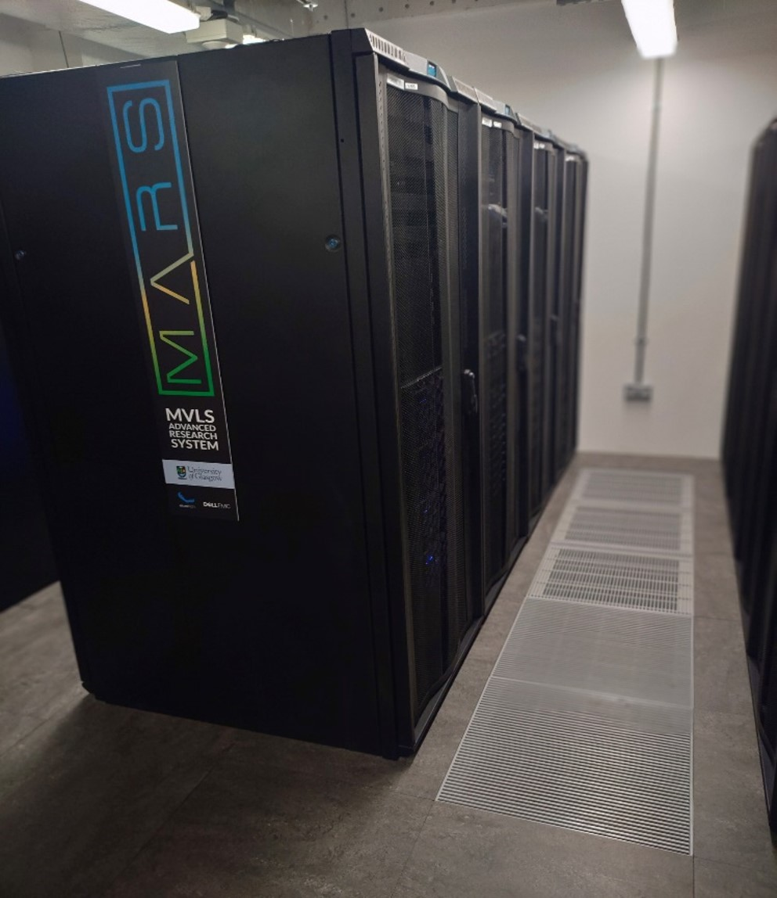
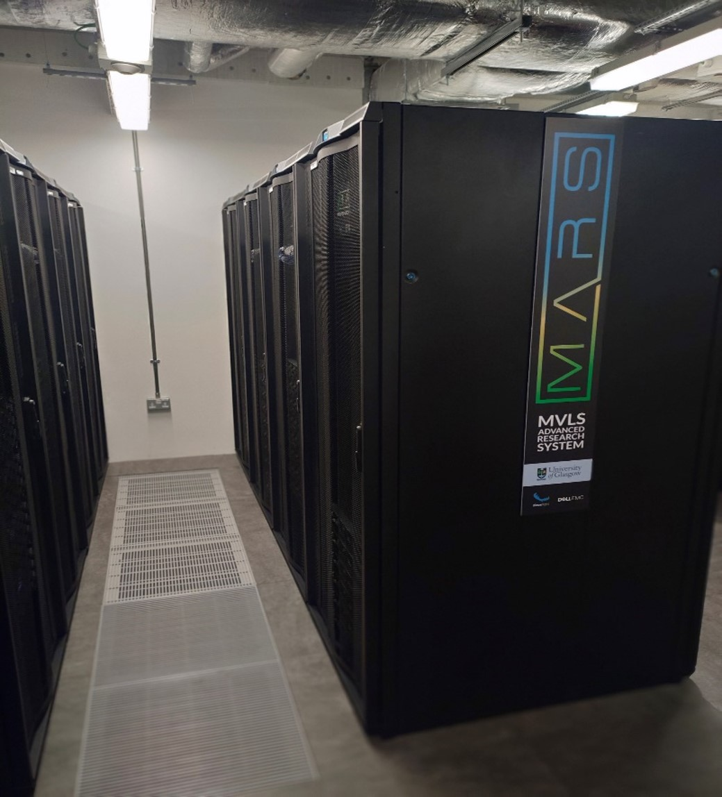
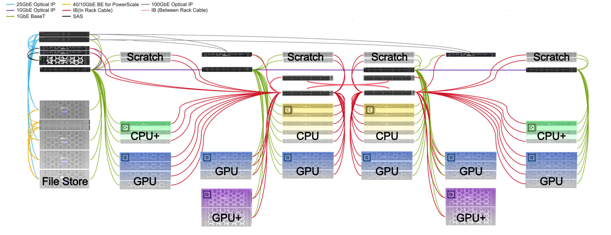

# MVLS Advanced Research System (MARS)

Built in 2023, this heterogenous computing platform is designed to support computationally intensive activities. Lead by a committee of senior researchers and supported by staff of the University of Glasgow, this HPC is built to support users in their research needs.

MARS is made of 40 nodes with differing specifications, catered to different research needs. More info on the resources of the system can be found [here](https://hpc.gla.ac.uk/clusters/mars/#compute-resources).

Software is continually installed and tested by out RSE and HPC-Admins, according to user needs. User can easily manage the software with a [module system](https://hpc.gla.ac.uk/guides/modules/).

Interested in getting access to Mars? See [here](https://hpc.gla.ac.uk/account-registration/) for more information!

Just got your account? We recommend reading through our [Getting Started Guide](https://hpc.gla.ac.uk/quickstart/)!




Physically the equipment is installed into the ICE building data centre.


## System Overview

Followed is a visualisation of the system components and their network connectivity (see top left). If you are looking for more information regarding the resources of the nodes, please see [Compute Resources](https://hpc.gla.ac.uk/clusters/mars/#compute-resources)



## Compute Resources

There are four types of nodes in the MARS cluster for processing different workloads!

### CPU Nodes
|||
|---|---|
|**Count**|9|
|**Specifications**|2x AMD 7543 Processors @2.8Ghz<br>32 cores each CPU<br>512Gb RAM|
|**Partition**|nodes|
|**Hostnames**|node01 – 09|


### CPU+ Nodes
|||
|---|---|
|**Count**|6|
|**Specifications**|2x AMD 7763 Processors @2.45Ghz<br>64 cores each CPU<br>1Tb RAM|
|**Partition**|smp|
|**Hostnames**|node101 – 106|


### GPU Nodes
|||
|---|---|
|**Count**|20|
|**Specifications**|2x AMD 7543 Processors @2.8Ghz<br>32 cores each CPU<br>256Gb RAM<br>Nvidia A40 (48GB)|
|**Partition**|gpu|
|**Hostnames**|gpu01 – 20|


### GPU+ Nodes

These resources can only be used as part of a project with GPU+ permission. Please specify the need for these resources in your project application.

|||
|---|---|
|**Count**|4|
|**Specifications**|2x AMD 7763 Processors @2.8Ghz<br>64 cores each CPU<br>512Gb RAM<br>Nvidia HGX – 4x A100 GPU (80GB)|
|**Partition**|gpuplus|
|**Hostnames**|gpu101 – 104|


## Power Consumption

We want to give users the possibility to estimate and, in the future, even calculate their individual power usage on MARS. This information is useful for calculating required carbon offset.

### Planning power usage ahead of time

Below we have listed rough estimates of peak power ratings for compute resources. Where the value could not be obtained from the vendor, the TDP (Thermal Design Power) was used, multiplied by 1.5. These numbers are not 100% accurate, as it always depends on the workload, but this can give you a good guideline for any planning, before starting your work.

||||
|---|---|---|
|**Component**|**Nodes**|**Power Consumption Estimation**|
|CPU – 2x AMD EPYC 7543|CPU, GPU|642 W the whole node<br>10 W per core|
|CPU – 2x AMD EPYC 7763|CPU+, GPU+|750 W the whole node<br>6 W per core|
|GPU – Nvidia A40|GPU|300 W per GPU|
|GPU – Nvidia A100 (SXM)|GPU+|400 W per GPU|

Please be aware, that factors like server cooling and other peripherals used to run MARS are not accounted for in the numbers above


### Using Slurm to Get Energy Usage

!!! info
    Please keep in mind that the numbers from Slurm are only accurate on node exclusive jobs. This is a job where you are using nodes entirely yourself.

You can get the energy usage of a job using the sacct command, querying specifically the “ConsumedEnergy” accounting field. The value returned is in Joules (J) and may include a unit prefix (K,M,G,T,P).


```
$ sacct -j 123456 -o JobID,ConsumedEnergy 
JobID        ConsumedEnergy  
------------ ----------------  
123456       10M 
```

3600 J are 1 Wh. If we take the example above of 10 MJ, that would be equivalent to 2.78 kWh.


### MARS Power

We don’t have reliable figures for the power usage of MARS, but it has a maximum power draw of 71 kW, this is however never reached, as the system is never 100% utilised. We would estimate the average power usage at 30 kW. In the future we will work to gather more reliable numbers for this!  

MARS is hosted within the [Imaging Centre of Excellence (ICE)](https://www.gla.ac.uk/colleges/mvls/ice/) in Glasgow. Power source of this facility is through [EDF](https://www.edfenergy.com/). The up-to-date fuel mix information can be found on their website. No special tariff for Renewable Energy Guarantees of Origin (REGO) is agreed. 

Scotland has lower emissions as the rest of the UK, due to the large amount of renewable energy produced. An overview of the energy production of Scotland on a quarterly basis is provided by the [Scottish Government](https://www.gov.scot/collections/quarterly-energy-statistics-scotland/). The [Carbon Intensity API](https://carbonintensity.org.uk/) is a helpful tool to show current and historic intensity in gCO2/kWh (grams of CO2 emissions per kWh) and fuel mix of different regions. MARS is in region 2 “South Scotland”, this gives a more realistic overview of the origin of the energy used to power MARS. 


### Usage in 2025

!!! info
    All information here is estimation, as we currently have no reliable way to measure these values! 

Below are total numbers for MARS for the year 2025. We included the CO2 emissions in two numbers, once as per the numbers publicised by the provider [EDF](https://www.edfenergy.com/) for Scottish Government accounting purposes and once as per the averages of numbers obtained through the [Carbon Intensity API](https://carbonintensity.org.uk/) for real carbon intensity measurements from the grid in South Scotland, which we believe more accurately captures the actual carbon intensity of MARS usage in practice. 


|||||
|---|---|---|---|
|**Power usage**|**CO2 emissions (EDF)**|**CO2 emissions (CI-API)**|**Energy cost**|
|186,880 kWh|37 tonnes|4 tonnes|£ 41,114 (excl. VAT)|


## University of Glasgow Sustainability

A collection of resources about sustainability at the University of Glasgow can be found [here](https://www.gla.ac.uk/myglasgow/sustainability/).


Find US
Address
ICE Building
QEUH
Langlands Dr,
Glasgow G51 4LB


[Privacy Notice]()
[Terms and Conditions]()
