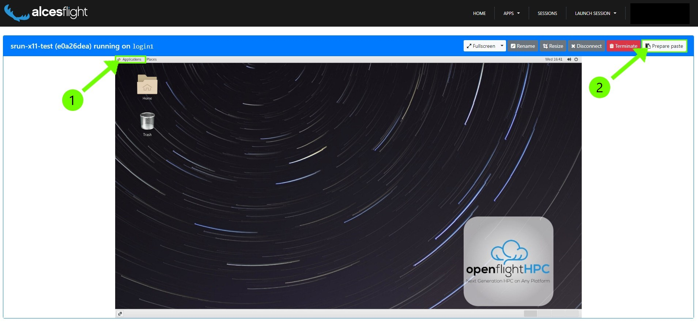

# RStudio

RStudio is an integrated development environment (IDE) for R and Python. It includes a console, syntax-highlighting editor that supports direct code execution, and tools for plotting, history, debugging, and workspace management.

We highly encourage the use of RScript for running your R code on the HPC. If you need help setting up your code to be requested through Slurm with RScript, don’t hesitate to contact us!

If you choose to use RStudio on the system, for debugging or code development, we encourage you to still take advantage of the Slurm scheduling system. That way you get enough resources for the code you are developing and don’t hinder other users by overloading the login-node.

=== "Lochan"

    More info is coming soon.

=== "MARS"

    First you will need to open a Flight Desktop session. You can find more information about that [here]().

    

    You want to open up a console. In the top left of your desktop press “Applications” (1). And then go to “System Tools” and choose “Terminal”

    In the console that opens you can then start your interactive GUI job. For that, copy the following text:

    ```
    srun-x11 --account=none --cpus-per-task=4 --mem=8G --time=03:00:00
    ```
    
    Enable “copy+paste” for your desktop session, for that press the “Prepare paste” button in the top right (2). Now you can paste the text into the console with right click and selecting “paste”
    
    The command you copied gives you a session with 4 CPU cores and 8GB of memory for 3 hours and will be accounted to no project. The parameters are the same like any other job, and can be adjusted to your needs. More information on that here [Slurm Settings]().
    
    You can tell that you have been connected to a compute node by the change in your console prompt, here from login2 to node01:
    
    ```
    [<GUID>@login2 [mars] ~]$ srun-x11 --account=none --cpus-per-task=4 --mem=8G --time=03:00:00 
    Enabling login2 to accept our X-connection... node01 being added to access control list 
    [<GUID>@node01 [mars] ~]$
    ```
    
    From here you can now load the RStudio module and start rstudio.
    
    ```
    module load apps/rstudio 
    rstudio
    ```
    
    A RStudio window within your Flight Desktop will open, where you can debug and test your code, as you are used to!

=== "GES-Petrarch"

    More info is coming soon.


## External Resources

[RStudio Website](https://posit.co/products/open-source/rstudio/)
