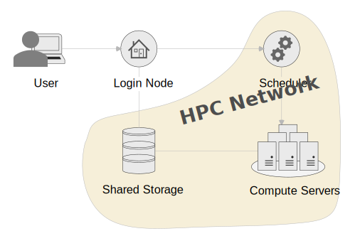
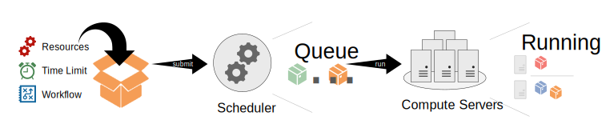

# Quickstart
This manual will give you all the information you need to use a HPC cluster. You can find more guides in the additional content after this page, you will find more specialised guides, tutorial and references.

## Introduction
HPC stands for High Performance Computing. Commonly this refers to a cluster of servers with resources shared by multiple people. To manage resource allocation a scheduler is used that, based on your definitions, creates an isolated work environment to run code. As the resource is shared and not always available, jobs can be queued for a while before they are run by the scheduler. No instant access to resources is guaranteed.

### How can HPC help you?
- Your work has outgrown your personal device's resources.
- Your work runs for hours or days and prevents you from using your personal device for other work.
- You do not have the right resources, like GPU, available to you in your personal device.
- You don't have the resources to acquire an own powerful computer and maintain it.

### Architecture
HPC can be built in in different configurations. This configuration is very popular and you will see it in many HPCs:



The HPC is made up of these components:

- **Login Node**: This is the system all users interact with. If you want to use any of the other components, it has to be through the login node.
- **Scheduler**: This is the brain of the cluster. All your scheduling and status requests from the login node go to this system. 
- **Compute Servers**: This symbolises all compute servers you could get allocations from through the scheduler. You should not access the servers directly unless you have an allocation. 
- **Shared Storage**: Most of the storage you interact with on the cluster is shared between the login node and all available compute servers. Therefore you can manage the data you need within your jobs from the login node.
- **HPC Network**: The network is shut off from the Campus network and therefore systems within it, will not be accessible to users outside of the login node.

### How does HPC work?
You will be submitting "work packages" in form of submission scripts, that define your resource requirement, an educated estimation of how long your job will run, and the workflow you want to run. Your work should run fully autonomous, this means no human interaction like GUI or console inputs. You can also have interactive sessions through HPC, these are useful for environment preparations, tests and debugging, but should be avoided for large production work. 

Your work package will be queued by the scheduler. The scheduler will decide where your job can run, based on your resource requirements described. Multiple jobs can run on one server. If there is enough resource available your job might run right away, otherwise it will be queued and run at a later time. You should be able to provide contact information, and the scheduler will keep you in the loop if your job has started, finished or failed. 



Scheduling is a complicated matter, and multiple factors play into the priority of your job, however generally, the smaller your job, the faster it will run, so it pays out to be efficient!

---

## Access the Cluster
After you got your account, you can log into the login node. The login node is the central point of access to the cluster for all users. This server is not very powerful and should therefore not be used for computational work. Any computational work should go through a job allocation on the scheduler.

!!! info 
    You have to be connected to the Campus network either via LAN, eduroam or VPN to access the cluster.

### Connection Information

=== "Lochan"

    - **Hostname**: `lochan.hpc.gla.ac.uk`
    - **Username**: *University of Glasgow GUID*
    - **Password**: *GUID Password*

### Connecting via SSH
You will need to use `SSH` to connect to the login node and use the HPC. The simplest way to connect is by opening a console and connect using the preinstalled `SSH` utility of your device (If you are prompted for a password, it will not show up while typing):

```
ssh <username>@<hostaname>
```

We would recommend you use a SSH GUI client for regular access to the platform, as it allows you to save sessions, and `copy+paste` more easily. Example software are [PuTTY](https://www.putty.org/) and [MobaXterm](https://mobaxterm.mobatek.net/), however you can use whatever you prefer. 

---

## Data Management
Data is an important part of HPC. Where and how to store your data is important for efficient usage of the platform. 

All storage available is to be used for the duration of your work. It is not expected to provide long term/primary storage. The data will assumed to be transient with only limited protection. As the HPC is not a primary storage solution, we recommend storing all HPC data, you can’t afford to lose in a primary, safe location like a centralised storage system provided by your school or a Team within Microsoft Teams. 


### Storage Spaces

=== "Lochan"

    !!! warning

        **This is not a trusted research environment**, therefore all research data must be anonymised prior to transferring it onto the system.


    **User Home**

    |||
    |---|---|
    |**Size**|100G (quota per user)|
    |**Path**|`/mnt/home/<GUID>`|
    |**Use**|Set up your environments and store all the scripts and data you need for your personal use.|

    **Shared User Scratch**

    |||
    |---|---|
    |**Size**|280Tb (shared between all cluster users)|
    |**Path**|`~/sharedscratch` or `/mnt/scratch/users/<GUID>`|
    |**Use**|This storage is shared between all nodes. Read and write data that you need during your jobs. Please ensure to clean up your scratch space after you are done processing your job, to make the space available for other users to use!|

 
### Transfer Data
To transfer data from your local machine (or another system), you can use `SSH`. You can do this either with the `scp` command:

```
scp <source file> <guid>@<hostname>:<target file>
```

Or you can use a graphical SFTP Client of choice, for example [WinSCP](https://winscp.net). Use the connection details of the login node, mentioned above to connect.

---

## Scheduler
The scheduler used is **Slurm Workload Manager**, developed by SchedMD. Slurm has a very in depth documentation themselves, which could be useful to read through, for a more in depth understanding of how this software works [Quick Start User Guide](https://slurm.schedmd.com/quickstart.html). 

The information here describes configurations you will need to know to use the specific cluster.

### Resources
Compute servers - also referred to as nodes - can carry different resource configurations to fit different workloads. For example, some servers might offer high amount of CPU, while others offer GPU resource.

=== "Lochan"

    Lochan is very heterogeneous, meaning it is comprised of a vast variety of hardware! You can  get an overview of all servers and their available resources by running the command below on  the system:

    ```
    sinfo -o "%20n %10c %20m %30G"
    ```

    ??? info "Explanation of command output"

        - **CPUS:** Number of CPUs available on the node.
        - **MEMORY:** Amount of memory / RAM available on the node in MB.
        - **GRES:** GPU resources available on the node. `gpu:<type>:<amount>`.

### Partitions / Queues
Partitions, also known as queues on other scheduling systems, are used to determine which nodes you want your job to run. To see the partition configuration of the HPC you are using run this command:

 ```
 scontrol show partition
 ```

=== "Lochan"

    |Partition|Description|
    |---|---|
    |cpu|This is the *default* partition, meaning this is chosen when no partition is specified. It contains all CPU focused servers of the Cluster.|
    |gpu|This partitions contains all servers with GPU resources available. You can specify which type with the `--gres` parameter.|

---

## Software

=== "Lochan"

    On Lochan, users are responsible for their own software. Though we offer some tools through modules, that make it easier for users to manage their own software. We also offer modules for software, that have a shared license, that is managed by the University of Glasgow.

    !!! tip "Manage shared software"

        If you are looking to manage shared software on Lochan, either exclusive for a specialist group or available for all Lochan users, please get in contact with the admins about requesting a domain software space.

    In some cases software installed will have to be restricted due to license concerns. You will have to contact the admin team via Ivanti to get access to these software. These software include:
    
    - Matlab
    - NVIDIA HPC SDK
    - Intel oneAPI


### Environment Modules
This is software that is centrally installed and can be used across the cluster. The full manual of `modules` can be found [here](https://modules.readthedocs.io/en/latest/).

The most used commands are listed below:

|Command|Description|
|---|---|
|`module available`|List all available modules on the system.|
|`module load <name>`|Activate module for use in your current session.|
|`module unload <name>`|Deactivate module from your current session.|
|`module search <search_term>`|Search for modules by name or description.|
|`module list`|List all active modules in your current session.|
|`module purge`|Deactivate all modules loaded in your current session.|

---

## Support
The RCaaS HPC Admin team is happy to help where possible, no matter if you are a novice or experienced user. Feel free to get in touch! All our services can be found through Ivanti:

[Ivanti Help Desk](https://glasgow.saasiteu.com/Modules/SelfService/#serviceCatalog/request/AFB25E75ED5E40E4BDF84FDEE6108945){ .md-button }


---
