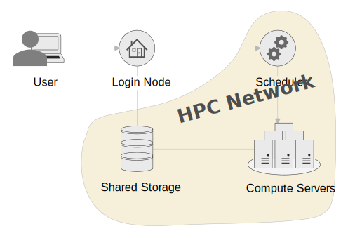
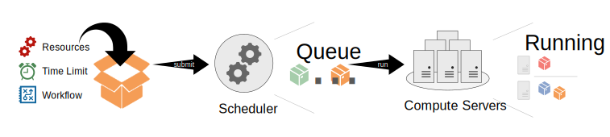

# Quickstart
This manual will give you all the information you need to use a HPC cluster. You can find more guides in the additional content after this page, you will find more specialised guides, tutorial and references.

## Introduction
HPC stands for High Performance Computing. Commonly this refers to a cluster of servers with resources shared by multiple people. To manage resource allocation a scheduler is used that, based on your definitions, creates an isolated work environment to run code. As the resource is shared and not always available, jobs can be queued for a while before they are run by the scheduler. No instant access to resources is guaranteed.

### How can HPC help you?
- Your work has outgrown your personal device's resources.
- Your work runs for hours or days and prevents you from using your personal device for other work.
- You do not have the right resources, like GPU, available to you in your personal device.
- You don't have the resources to acquire an own powerful computer and maintain it.

### Architecture
HPC can be built in in different configurations. This configuration is very popular and you will see it in many HPCs:



The HPC is made up of these components:

- **Login Node**: This is the system all users interact with. If you want to use any of the other components, it has to be through the login node.
- **Scheduler**: This is the brain of the cluster. All your scheduling and status requests from the login node go to this system. 
- **Compute Servers**: This symbolises all compute servers you could get allocations from through the scheduler. You should not access the servers directly unless you have an allocation. 
- **Shared Storage**: Most of the storage you interact with on the cluster is shared between the login node and all available compute servers. Therefore you can manage the data you need within your jobs from the login node.
- **HPC Network**: The network is shut off from the Campus network and therefore systems within it, will not be accessible to users outside of the login node.

### How does HPC work?
You will be submitting "work packages" in form of submission scripts, that define your resource requirement, an educated estimation of how long your job will run, and the workflow you want to run. Your work should run fully autonomous, this means no human interaction like GUI or console inputs. You can also have interactive sessions through HPC, these are useful for environment preparations, tests and debugging, but should be avoided for large production work. 

Your work package will be queued by the scheduler. The scheduler will decide where your job can run, based on your resource requirements described. Multiple jobs can run on one server. If there is enough resource available your job might run right away, otherwise it will be queued and run at a later time. You should be able to provide contact information, and the scheduler will keep you in the loop if your job has started, finished or failed. 



Scheduling is a complicated matter, and multiple factors play into the priority of your job, however generally, the smaller your job, the faster it will run, so it pays out to be efficient!

---

## Access the Cluster
After you got your account, you can log into the login node. The login node is the central point of access to the cluster for all users. This server is not very powerful and should therefore not be used for computational work. Any computational work should go through a job allocation on the scheduler.

!!! info 
    You have to be connected to the Campus network either via LAN, [eduroam](https://www.gla.ac.uk/myglasgow/it/eduroam/) or [VPN](https://www.gla.ac.uk/myglasgow/it/vpn/) to access the cluster.

### Connection Information

=== "Lochan"

    - **Hostname**: `lochan.hpc.gla.ac.uk`
    - **Port**: 22
    - **Username**: *University of Glasgow GUID*
    - **Password**: *GUID Password*

=== "GES-Petrarch"

    - **Hostname**: `petrarch_esd.hpc.gla.ac.uk`
    - **Port**: 22
    - **Username**: *University of Glasgow GUID*
    - **Password**: *On first login provided by Administrator*

    Please change your password upon first login using the command `passwd`

=== "MARS"

    - **Hostname**: `mars-login.ice.gla.ac.uk`
    - **Port**: 22
    - **Username**: *University of Glasgow GUID*
    - **Password**: *The password to your University of Glasgow account*

GUID must be in lowercase ex: 999999x or xx999x

The same information can also be used to log in via SFTP to copy files from your local device onto the system.

### Connecting via SSH
You will need to use `SSH` to connect to the login node and use the HPC. The simplest way to connect is by opening a console or a terminal program and connect using the preinstalled `SSH` utility of your device (If you are prompted for a password, it will not show up while typing):

```
ssh <username>@<hostaname>
```

We would recommend you use a SSH GUI client for regular access to the platform, as it allows you to save sessions, and `copy+paste` more easily. Example software are [PuTTY](https://www.putty.org/) and [MobaXterm](https://mobaxterm.mobatek.net/), however you can use whatever you prefer. 

---

## Data Management
Data is an important part of HPC. Where and how to store your data is important for efficient usage of the platform. 

All storage available is to be used for the duration of your work. It is not expected to provide long term/primary storage. The data will assumed to be transient with only limited protection. As the HPC is not a primary storage solution, we recommend storing all HPC data you can’t afford to lose in a primary, safe location like a centralised storage system provided by your school or a Team within Microsoft Teams. 

We recognise this is an issue for many schools and it is on the radar as a future area that requires attention. 

You can use [Rclone](https://hpc.gla.ac.uk/guides/rclone/) to manage your data.


### Storage Spaces


=== "Lochan"

    !!! warning

        **This is not a trusted research environment**, therefore all research data must be anonymised prior to transferring it onto the system.

    **User Home**

    |||
    |---|---|
    |**Size**|100G (quota per user)|
    |**Path**|`/mnt/home/<GUID>`|
    |**Use**|Set up your environments and store all the scripts and data you need for your personal use.|

    **Shared User Scratch**

    |||
    |---|---|
    |**Size**|280Tb (shared between all cluster users)|
    |**Path**|`~/sharedscratch` or `/mnt/scratch/users/<GUID>`|
    |**Use**|This storage is shared between all nodes. Read and write data that you need during your jobs. Please ensure to clean up your scratch space after you are done processing your job, to make the space available for other users to use!|

=== "GES-Petrarch"

    !!! warning

        **This is not a trusted research environment**, therefore all research data must be anonymised prior to transferring it onto the system.

    **User Home**

    |||
    |---|---|
    |**Size**|100G (quota per user)|
    |**Path**|`/mnt/home/<GUID>`|
    |**Use**|Set up your environments and store all the scripts and data you need for your personal use.|

    **Shared User Scratch**

    |||
    |---|---|
    |**Size**|40Tb (shared between all cluster users)|
    |**Path**|`~/sharedscratch` or `/mnt/shared-scratch/<GUID>`|
    |**Use**|This storage is shared between all nodes. Save and write data that you need between your parallel and array jobs that run on multiple nodes simultaneously. Also, if Local Node Scratch is not sufficient, use this instead, as it has a larger capacity.|

    **Local Node Scratch**

    |||
    |---|---|
    |**Path***|`~/localscratch`|
    |**Use**|Data Processing. All nodes have a scratch storage space that is dedicated to that node and not shared with others. We recommend running your jobs here, if they only run on one node, especially if they are read/write intensive. Don’t forget to move your data to a shared storage within your job, after you are done processing! Data left unused on these storage spaces will be deleted after 2 weeks!|


=== "MARS"

    !!! warning

        **This is not a trusted research environment**, therefore all research data must be anonymised prior to transferring it onto the system. More information on the can be found here [Research Data on MARS: What to Know]().


**Home Storage**

|||
|---|---|
|**Size**|40Gb (quota per user)|
|**Path**|`/users/<GUID>`|
|**Use**|**Data Storing**<br>Set up your environments and store all the scripts and data you need for your personal use.|


**Project Storage**

|||
|---|---|
|**Size**|As requested in application (2.6Pb in total)|
|**Path**|`/mnt/data/project<ProjectNumber>`|
|**Use**|**Data Storing**<br>Save scripts and data you and the colleagues in your project use together. Each project is assigned dedicated space. The size of this space is dependent on what was requested in the original Project application, but can be extended on request. You will be told the <ProjectNumber> when the project has been created on MARS.|


**Shared User Scratch**

|||
|---|---|
|**Size**|~180Tb (shared between all cluster users)|
|**Path**|`~/sharedscratch` or `/mnt/scratch/users/<GUID>`|
|**Use**|**Data Processing**<br>This storage is shared between all nodes. Read and write data that you need during your jobs.<br>Please ensure to clean up your scratch space after you are done processing your job, to make the space available for other users to use!|


**Local Node Scratch**

|||
|---|---|
|**Size**|Varies depending on the node type (shared between all node users):<br>CPU Nodes: 400Gb<br>CPU+ Nodes: 400Gb<br>GPU Nodes:  700Gb<br>GPU+ Nodes: 1.7Tb|
|**Path**|`~/localscratch` or `/tmp/users/<GUID>`|
|**Use**|**Data Processing**<br>This storage is local to the node and can’t be accessed outside of it. Read and write here for the best possible storage performance. If you drop files into the localscratch of the login node it won’t be available to you on the compute nodes, so the moving of data has to be part of your workflow /submission script.<br>Please ensure to clean up your scratch space after you are done processing your job, to make the space available for other users to use!|


### Storage Quotas

There are quotas set up across the cluster for different filesystems / shares. A quota means you are unable to write data after that quota is reached. These quotas are set up, to prevent users from using the cluster as data storage. The cluster should only be used to process data, any results or unused data should be moved off, after a job has finished running. The login node and all compute nodes, can connect to other campus systems or the internet, to perform data transfers.

=== "Lochan"

    More info is coming soon.

=== "GES-Petrarch"


    **Filesystem Quotas**

    ||||||
    |---|---|---|---|---|
    |**Name**|**Path**|**Soft Limit**|**Hard Limit**|**Grace Period**|
    |User Home|/mnt/home|100GiB|120GiB|7 days|
    |Shared Scratch|/mnt/shared-scratch or ~/sharedscratch|2000GiB|2100GiB|7 days|

    **Clean Up Time on Scratch Space**

=== "MARS"

    More info is coming soon.

We also set up the clean-up scratch as:

=== "Lochan"
    
    More info is coming soon.

=== "GES-Petrarch"

    ||||
    |---|---|---|
    |**Filesystem**|**Retention Time**|**Note**|
    |/tmp/local-scratch|2 weeks|Exceptions Sebastian: 2 months, Todd: 2 months|
    |/mnt/shared-scratch|4 weeks||

=== "MARS"

    More info is coming soon.

 
**Quota Terminology**

|||
|---|---|
|**Term**|**Explanation**|
|**Soft Limit**|•	Users are still able to use the system normally and write files until either the Grace period runs out or they reach the hard limit, whichever comes first.<br>•	Referred to as "quota" in the quota command output.|
|**Hard Limit**|•	When reached users won't be able to further write files. <br>•	Referred to as "limit" in the quota command output.|
|**Grace Period**|Time until the user's quota turns from a soft limit to a hard limit. You have to act during this period on reducing your quota to be lower than the soft limit again to avoid any issues logging into or using the system.|


**Quota Warning**

If you are over your quota's hard limit or past your grace period exceeding the soft limit you will get the following errors when working on the system:
`Disk quota exceeded`
In addition, when logging into the login node, you should get a warning, that looks something like this:
```
--------- Warning: Quota violation! ---------
You are violating the following quotas:
In block grace period on /mnt/shared-scratch
Block limit reached on /mnt/home
 
use command "quota -s" for more information
---------------------------------------------
[<GUID>@headnode01 ~]$
```

In block grace period... --> Quota is reached and grace period has started

Block limit reached... --> Limit (hard) is reached


**Analyse your storage usage**

To see if or how close you are to reaching your quota, you can use the following command on the login node:

```
[<GUID>@headnode01 ~]$ quota -s
[<GUID>@headnode01 ~]$ quota -s
Disk quotas for user <GUID> (uid <UID>):
     Filesystem   space   quota   limit   grace   files   quota   limit   grace
10.3.95.31:/exports/home
                  8280K    100G    120G            1775       0       0
10.3.95.31:/exports/scratch
                   291G    500G    550G              16       0       0

```
In the first column "Filesystem" you see the name of the filesystem. Since it is a mounted share, you will see the mount information. If you want to see which local filesystem this equates to, you can add the --show-mntpoint parameter.
 
The second column "space" shows the currently used space on the filesystem by your user. This will give you an idea of how close you are to reaching either your quota or your limit. If you are over your quota, you will see an asterisk "*" next to the number too.
 
The sixth column "files" shows you the number of files on the filesystem. This currently does not matter, as file count quotas are not set up. You can tell by the last three columns being either empty or set to 0.
 
If you have an elaborate directory structure and you are unsure where the bulk of your data is the command du (from disk usage) can help you narrow that down. Here a couple of helpful commands:
 
Show size of all subdirectories in a directory:

```
[<GUID>@headnode01 ~]$ du -h -d 1  ~/sharedscratch/
121G    /mnt/home/<GUID>/sharedscratch/catPictures
111G    /mnt/home/<GUID>/sharedscratch/mydata
61G     /mnt/home/<GUID>/sharedscratch/myResults
291G    /mnt/home/<GUID>/sharedscratch/
```

Show all directories and files over 50GiB throughout a whole filesystem:
```
[<GUID>@headnode01 ~]$ du -h -t 50G -a ~/sharedscratch/
121G    /mnt/home/<GUID>/sharedscratch/catPictures/file
121G    /mnt/home/<GUID>/sharedscratch/catPictures
76G     /mnt/home/<GUID>/sharedscratch/mydata/dataset1
111G    /mnt/home/<GUID>/sharedscratch/mydata
61G     /mnt/home/<GUID>/sharedscratch/myResults/file1
61G     /mnt/home/<GUID>/sharedscratch/myResults
291G    /mnt/home/<GUID>/sharedscratch/
```

For both of these command you can pipe the result to sort –h to sort them by size. To reverse this sort also use the -r parameter:
```
[<GUID>@headnode01 ~]$ du -h -d 1  ~/sharedscratch/ | sort -h
61G     /mnt/home/<GUID>/sharedscratch/myResults
111G    /mnt/home/<GUID>/sharedscratch/mydata
121G    /mnt/home/<GUID>/sharedscratch/catPictures
291G    /mnt/home/<GUID>/sharedscratch/
```

### Data Backup
Below are the types of data found on the cluster filesystems, with information if they are backed up, where they are not backed up, a comment explains why.
The backups are done using the Rubrik backup system, managed by Central IT. 

=== "Lochan"

    More info is coming soon.


=== "GES-Petrarch"
    ||||||
    |---|---|---|---|---|
    |**Name**|**Path**|**Owner**|**Backed-up**|**Comment**|
    |Homes|/exports/home|Individual user|Yes||
    |Software Catalogue|/exports/software|Administrators|Yes||
    |Shared-Scratch|/exports/scratch|Individual user|No|Data is not meant to be persistent|
    |Local-Scratch|/tmp/local-scratch|Individual user|No|Data is not meant to be persistent|


=== "MARS"

    While there is significant redundancy in the hardware, there is no backup.


### Data Transfer
To transfer data from your local machine (or another system), you can use `SSH`. You can do this either with the `scp` command:

```
scp <source file> <guid>@<hostname>:<target file>
```

Or you can use a graphical SFTP Client of choice, for example [WinSCP](https://winscp.net). Use the connection details of the login node, mentioned above to connect.

---

## Scheduler
The scheduler used is **Slurm Workload Manager**, developed by SchedMD. Slurm has a very in depth documentation themselves, which could be useful to read through, for a more in depth understanding of how this software works [Quick Start User Guide](https://slurm.schedmd.com/quickstart.html). 

The information here describes configurations you will need to know to use the specific cluster.

### Resources
Compute servers - also referred to as nodes - can carry different resource configurations to fit different workloads. For example, some servers might offer high amount of CPU, while others offer GPU resource.

=== "Lochan"

    Lochan is very heterogeneous, meaning it is comprised of a vast variety of hardware! You can  get an overview of all servers and their available resources by running the command below on  the system:

    ```
    sinfo -o "%20n %10c %20m %30G"
    ```

    ??? info "Explanation of command output"

        - **CPUS:** Number of CPUs available on the node.
        - **MEMORY:** Amount of memory / RAM available on the node in MB.
        - **GRES:** GPU resources available on the node. `gpu:<type>:<amount>`.

=== "GES-Petrarch"

    More info is coming soon.


=== "MARS"

    More info is coming soon.


### Partitions / Queues
Partitions, also known as queues on other scheduling systems, are used to determine which nodes you want your job to run. To see the partition configuration of the HPC you are using run this command:

 ```
 scontrol show partition
 ```

=== "Lochan"

    |Partition|Description|
    |---|---|
    |cpu|This is the *default* partition, meaning this is chosen when no partition is specified. It contains all CPU focused servers of the Cluster.|
    |gpu|This partitions contains all servers with GPU resources available. You can specify which type with the `--gres` parameter.|


=== "GES-Petrarch"

    |Partition|Description|Node List|
    |---|---|---|
    |cpu|All Small Nodes servers. This is the default partition if none is defined.|node[001-006]|
    |cpuplus|All Large Nodes servers|node[007-008]|
    |cpuall|Both Small Nodes and Large Nodes servers|node[001-008]|
    |gpu|All GPU Nodes|node[009-010]|

=== "MARS"

    |Partition|Description|Specifications|Count|Node List|
    |---|---|---|---|---|
    |nodes|This is the default partition if none is defined|2x AMD 7543 Processors @2.8Ghz<br>32 cores each CPU<br>512Gb RAM|9|node[01-09]|
    |smp|CPU+ Nodes|2x AMD 7763 Processors @2.45Ghz<br>64 cores each CPU<br>1Tb RAM|6|node[101-106]|
    |gpu|GPU Nodes (A40)|2x AMD 7543 Processors @2.8Ghz<br>32 cores each CPU<br>256Gb RAM<br>Nvidia A40 (48GB)|20|node[01-20]|
    |gpuplus|GPU+ Nodes (A100)|2x AMD 7763 Processors @2.8Ghz<br>64 cores each CPU<br>512Gb RAM<br>Nvidia HGX – 4x A100 GPU (80GB)|4|node[101-104]|


---

## Software

=== "Lochan"

    On Lochan, users are responsible for their own software. Though we offer some tools through modules, that make it easier for users to manage their own software. We also offer modules for software, that have a shared license, that is managed by the University of Glasgow.

    !!! tip "Manage shared software"

        If you are looking to manage shared software on Lochan, either exclusive for a specialist group or available for all Lochan users, please get in contact with the admins about requesting a domain software space.

    In some cases software installed will have to be restricted due to license concerns. You will have to contact the admin team via Ivanti to get access to these software. These software include:
    
    - Matlab
    - NVIDIA HPC SDK
    - Intel oneAPI

=== "GES-Petrarch"

    More info coming soon.


=== "MARS"

    MARS uses a modular software control system to store and enable applications and tools. This means that we can install multiple versions of the same software and have these work independently for different users. All software currently available on MARS can be listed, loaded, and unloaded, by using the command module.

    Below a list with all available [Modules](https://hpc.gla.ac.uk/guides/modules/) on MARS. This list is growing, as we keep installing software our users need for their work on the cluster. Don’t see the software you need? Don’t hesitate to get in contact with us!

    Modules marked with a * are restricted modules. To gain access, please contact us!

    To load a Module on MARS use the following syntax:

    `module load <module-type>/<module-name>/<module-version>`

    ||||
    |---|---|---|
    |**Module Type**|**Module Name**|**Module Version**|
    |apps|alphafold*|3.0.1|
    |apps|apptainer|1.3.4|
    |apps|dmtcp|3.1.2|
    |apps|java|23.0.1|
    |apps|juliaup|1.18.9|
    |apps|matlab*|r2024b|
    |apps|miniforge|24.7.1|
    |apps|nvhpc*|24.9|
    |apps|nvidia-cuda|12.6.2|
    |apps|oneapi*|2024.2.1|
    |apps|python3|3.12.7|
    |apps|R|4.4.1|
    |apps|rstudio|2024.09.0|
    |compilers|gcc|8.5.0,|14.2.0|
    |libs|gcc|8.5.0,|14.2.0|
    |libs|openblas|0.3.28|
    |mpi|openmpi|5.0.5|


For more and advanced information on Environment Modules, see the [official documentation](https://modules.readthedocs.io/en/latest/).


### Environment Modules
This is software that is centrally installed and can be used across the cluster. The full manual of `modules` can be found [here](https://modules.readthedocs.io/en/latest/) or check our [guide](https://hpc.gla.ac.uk/guides/modules/).

The most used commands are listed below:

|Command|Description|
|---|---|
|`module available`|List all available modules on the system.|
|`module load <name>`|Activate module for use in your current session.|
|`module unload <name>`|Deactivate module from your current session.|
|`module search <search_term>`|Search for modules by name or description.|
|`module list`|List all active modules in your current session.|
|`module purge`|Deactivate all modules loaded in your current session.|

---

## Support
The RCaaS HPC Admin team is happy to help where possible, no matter if you are a novice or experienced user. Feel free to get in touch! All our services can be found through Ivanti:

[Ivanti Help Desk](https://glasgow.saasiteu.com/Modules/SelfService/#serviceCatalog/request/AFB25E75ED5E40E4BDF84FDEE6108945){ .md-button }


---
